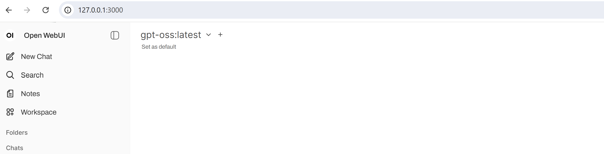
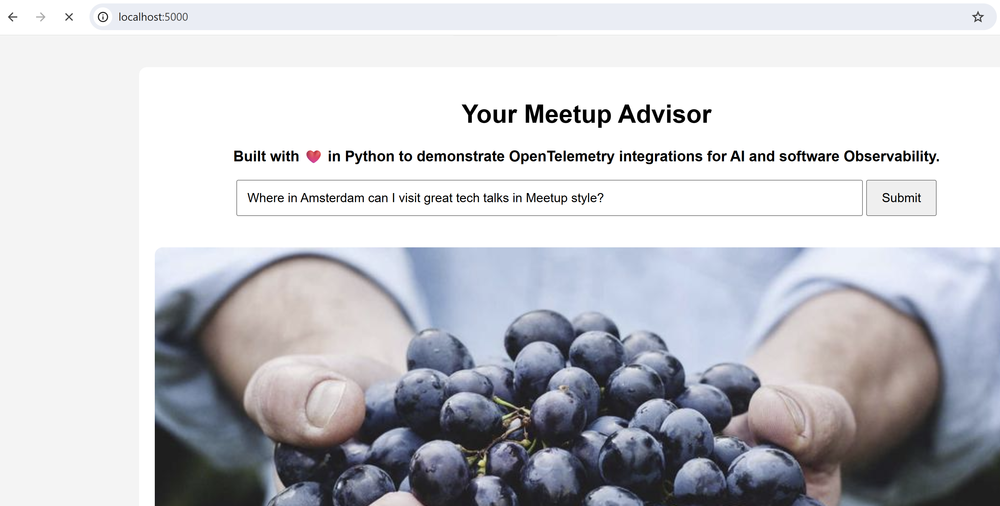

# demo-ai-observability

Welcome to this *self-guided* demo repository for AI Observability. During some small exercies you will learn how to quickly setup a AI Observability Lab environment.

This Lab environment exists of:

- Local LLM setup using Ollama and Open WebUI.
- Our preffered model is `gpt-oss:latest`, but you can always pick your own.
- Small AI Agent examples to give a try.


# Setup environment

Ensure you have initialized your local `.env` file. Below a snippet from [example .env](.env-example).

Create your *personal* local *.env* configuration. Take care since this file contains sensitive information.

```
cp .env-example .env
```

```
# Compose settings
COMPOSE_PROJECT_NAME=demo-ai-observability

# Ollama settings
OLLAMA_MODELS=gpt-oss:latest # llama3:latest
OLLAMA_MODEL_DEFAULT=gpt-oss:latest
OPENAI_API_KEY=blaat            # Just a dummy value
```

Now you can spin up your local LLM Setup using Docker Compose (see [compose.yaml](./compose.yaml)). It could take some minutes to initially download the `gpt-oss:latest` or other selected model(s).

```
docker compose up -d
```

Now have a look with `docker ps` or `docker compose status`. Validate if both `ollama` and `open-webui` containers are successfully started and made available through localhost.

If everything is oke, you can do the initial browser login into `Open WebUI` at `http://127.0.0.1:3000`.



Now explore the interface and give the *Chat window* a try.

# Buzzword Bingo exercise

This first exercise you will work with both the `agent` and `interactive` version of Buzzword Bingo. Here you will get some idea how *LangChain*, *LangGraph* and *LangFuse* work together.

This example code:
- Extract *Buzzword hits* from *User Prompt* using the LLM predefined Chat Prompt template. *Bingo threshold* is set to 5.
- Implement a simple way of *Memory* (*State table*) storing previous sessions.
- How to integrate the *LangFuse* *CallbackHandler* and *get_client* and *propagate_attributes*.

Buzzword Bingo is just a silly example, but it showns how simple you can use *LangChain*, *LangGraph* and *LangFuse* with a local *Ollama* Stack.

## Try out the agent code sample

This will run various *Bingo sessions* and will create a `bingo:true` or `bingo:false` result.

```
uv run --env-file .env .\agents\meetup-bingo-agent.py
```

Take a look at your *LangFuse* environment if *traces* are shown.

- Inspect the *Tracing*.
- Validate which Bingo sessions succeeded and where Bingo!.
- Try to identify the *User Prompt*.
- Which metadata is logged.


## Try out the interactive code sample

This time you can try-out yourself, providing the *user Prompt*. Here the threshold is set to 2.

Just ask the question : *Does this session about AI Observability contain enough Buzzword Bingo?*

```
uv run --env-file .env .\agents\meetup-bingo-interactive.py
```

Following interactive console is opened.

```
Buzzword Bingo — type 'exit' to quit.
Session: meetup_bingo_console | Threshold: 2

> Does this session about AI Observability contain enough Buzzword Bingo?
```

Result you get is:

```
Hits (2): ['AI', 'Observability'] | Bingo: True
BINGO! 🎉 Keep going or 'exit'.
```

Why does the output, when Bingo, stay `deterministic` ?

Take a look at your *LangFuse* environment if *traces* are shown.

- Inspect the *Tracing*.
- Validate which Bingo sessions succeeded and where Bingo!.
- Try to identify the *User Prompt*.
- Which metadata is logged.

# Tools Demo exercise

This exercise will introduce the usage of *Tools*. Again you will work with both the `agent` and `interactive` version of demo snippet. Here you will get some idea how *LangChain*, *LangGraph* and *LangFuse* work together.

This example code:
- This is a way to implement easy [add, multiply] and more complex 'square' calculations.
- You implement prefined logic using *Tools*.
- Introduce the *System Prompt*, which will be passed with the *User Prompt*.

Again silly example, but does the job explaning the implementation of using *Tools*.

## Try out the agent code sample

```
uv run --env-file .env .\agents\tools-demo-agent.py
```

The User Prompt is set to **"what is 250 + 250 + 500 + 1 * 5?"**.

What is the correct answer?

You may see that no *LangFuse* has been implemented yet. With the *examples* try to implement Observability using the *CallbackHandler*, *get_client* and *propagate_attributes* functions.

If you successfully integrated *LangFuse* you can take a look at your *LangFuse* environment if *traces* are shown.

- Inspect the *Tracing*.
- Validate if you can find the *System Prompt*.
- Try to identify the *User Prompt*.
- Which metadata is logged.

## Try out the interactive code sample

This time we can try it again ourselves. Let's challenge the LLM with a slidely different *User Prompt*.

**"what is (250 + 250 + 500 + 1) * 5?"**

Let's find out if the answer keeps the same. What do you think?

```
uv run --env-file .env .\agents\tools-demo-interactive.py
```

Take a look at your *LangFuse* environment if *traces* are shown.

- Inspect the *Tracing*.
- Validate if you can find the *System Prompt*.
- Try to identify the *User Prompt*.
- Which metadata is logged.

# Kubernetes Diagnostics exercise

This exercise we will make things more applicable for *Platform Engineers*.  During this exercise you will learn about *AI Agent* use cases and what the difference is between a *AI Agent* and *Agentic AI*.

Lastly kudos to [Shamsher Khan](https://github.com/opscart/k8s-ai-diagnostics), since I've used his code to further integrate with the local *LLM Stack* and *LangFuse* Observability.

Take notice that the following prereqs do apply:

- Those LLM queries do require more processing power, so you may hear the fans !!!
- You have a Kubernetes cluster available through *kubectl* CLI.
- You have a namespace to scan for demo purposes.
- Optionally you can apply failure scenarios from [K8S Failures](./k8s-diag/k8s-manifests/).

## Using the K8S AI Agent

Lets start analysing my *demo* namespace. It contains a *oom-test* deployment in *CrashLoopBackOff* state.

```
uv run --env-file .env .\k8s-diag\k8s_ai_agent.py
```
After providing the namespace the following will occur.

```
🔗 Using Ollama at http://localhost:11434/v1  |  model: gpt-oss:latest
📡 Langfuse tracing active  |  endpoint: https://cloud.langfuse.com
Enter the namespace to scan: demo
🔍 Found 1 unhealthy pod(s): ['oom-test-69dd4b7bbf-ljj6v']

🤖 Analyzing pod 'oom-test-69dd4b7bbf-ljj6v' with model 'gpt-oss:latest'...
```

WHen the analysis is complete, validate the resolution. For you skip the remediation.

```
🔧 Detected OOMKilled. Suggest increasing memory limits to 400Mi.
Dry run: Would patch deployment memory limit to 400Mi
Patch command: kubectl patch deployment oom-test -n demo --type json -p [{"op": "replace", "path": "/spec/template/spec/containers/0/resources/limits/memory", "value": "400Mi"}]
Current memory limit: 512Mi
Do you want to apply the above remediation? (yes/no): no
Skipping remediation.

📡 Langfuse traces flushed.
```

Take a look at your *LangFuse* environment if *traces* are shown.

- Inspect the *Tracing*.
- Validate both the large *Input* and *Output*.
- Try to identify how much Input / Output (Usage) is used?
- What is the used Temperature?

## Using the Agentic Agent example

Now that you have a try to the *AI Agent* you now are going to run the *Agentic Agent* version. 

The *Agentic* version is differentiate on the following features:

- Workflow based, following the autonomous monitoring loop
    - Observe, Plan, Act, Learn.
- Works Autonomous without interaction and learns from previous attempts.
- Stores previous *state* in memory, so it learns from previous attempts.

Do you want to dive deeper? Just take a look at the detailed [README.md](./k8s-diag/README.md).

first create some pods for the running the test scenarios.

```
kubectl apply -f .\k8s-diag\agentic-ai\test-scenarios -n demo
deployment.apps/mysql-client created
deployment.apps/memory-hungry created
deployment.apps/web-server created
deployment.apps/alpine-app created
```

Now let's start the *Agentic Agent*.

```
uv run --env-file .env .\k8s-diag\agentic-ai\agentic_monitor.py --namespace demo --interval 30
```

Starting the agent directly start the logic run and later at an interval of 30 seconds in our target namespace 'demo'. Keep in mind it stores the actual *Memory* in a file called `agentic_memory.json`.

After several runs (most) problems will be fixed.

Take a look at your *LangFuse* environment if *traces* are shown.

- Inspect the *Tracing*.
- Validate the Preview at Span level.
- Try to identify how much Input / Output (Usage) is used?
- Do we use LangGraph here?

To conclude an *AI Agent* is your Assistant, whereby the *Agentic Agent* works autonomously.

# Final exercise Meetup Advisor

This last exercise shows how you can integrate an AI Agent into a Web Application, howto implement Observability and split both Otel Spans for Apps and AI Apps.

## Try out the interactive code sample

First let's give the barebone example a try.

```
uv run --env-file .env .\agents\meetup-tracing-demo.py
```

After you start the AI Agent it provides a terminal like below.

```
Meetup Advisor — type 'exit' to quit.
Session: meetup-tracing-demo

> 
```

Now ask him a question like : **Where in Amsterdam can I visit great tech talks in Meetup style?**

Is that the answer you expected? Do you get the same answer everytime? Can you explain this by analyzing the tracing.

Take a look at your *LangFuse* environment if *traces* are shown.

- Inspect the *Tracing* and identify the reasoning.
- Validate the Preview at Span level.
- Try to identify how much Input / Output (Usage) is used?
- Does it hallucinate ?

## Try out the web-based example

This last example we are deploying a Flask Web App using Python. This example we included both an `agent.py` and `observability.py` library.

Take notice that with this exercise you need to configure your *Sentry* details in [.env](.env).

```
# Sentry variables
SENTRY_DSN=https://<your-dsn-entry>.ingest.de.sentry.io/<project-id>
SENTRY_OTLP_ENDPOINT=https://<project-id>.ingest.de.sentry.io/api/<project-id>/integration/otlp
SENTRY_AUTH_TOKEN="sntryu_xxxxxxxxxxxx-replace-me"
```

Let's go and start the web app.

```
uv run --env-file .env .\webapp\app.py
```

Now open your browser and go to `http://127.0.0.1:5000`.



Now ask the same question again:  **Where in Amsterdam can I visit great tech talks in Meetup style?**

Do you note a difference with the previous answer?  Do you get the same answer everytime? Can you explain this by analyzing the tracing.

Take a look at your *LangFuse* environment if *traces* are shown.

- Inspect the *Tracing* and identify the reasoning.
- Validate the Preview at Span level.
- Try to identify how much Input / Output (Usage) is used?
- Does it provide correct information ?

Now give try to edit the `agent.py` configuration that the *System Prompt* contains your favorite topic or hobby. Restart the WebApp and try to ask questions again.


Last take a look at your *Sentry* environment.

- Look in specific for the *HTTP* spans.
- What are the slowest parts when Observing AI Infrastructure?
- Why can't you find the *AI* spans?

# Conclusion

AI Observability is something that's not simply infrastructure. The approach requries a *non-deterministic* approach.
Luckily *OpenTelemetry* as standard helps to optimize the *Semantic Conventions*.

Any questions or you want a copy of the slides. Contact me through LinkedIn or Github.